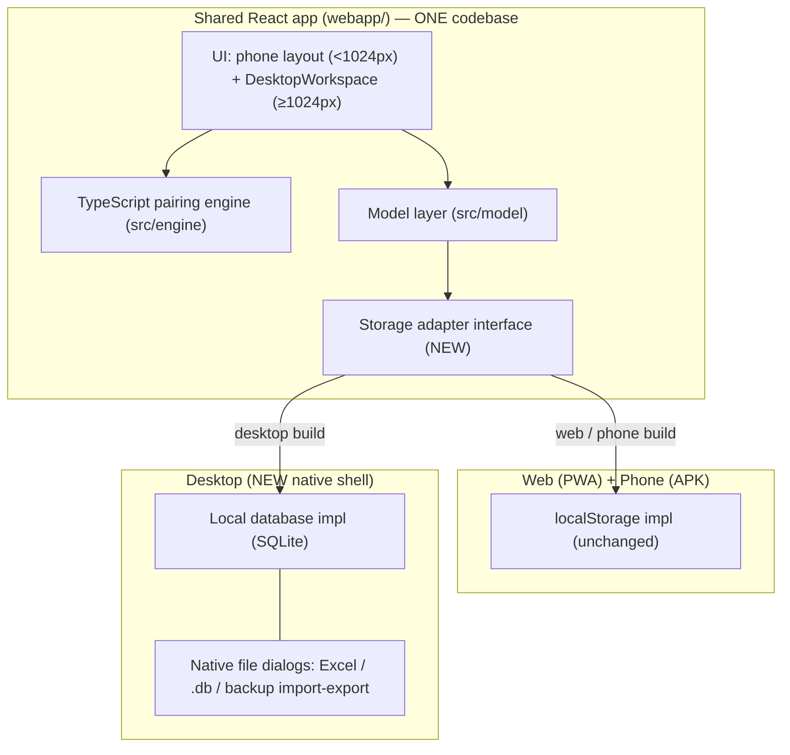

# Desktop Modernization Plan — KLIK KLAK

**Status:** Finalized — all decisions locked. Shell: **Tauri v2**; storage:
**SQLite-as-document-store (6a)** + one-time legacy import; Python app **retired
after one transition release**; **converged on KLIK KLAK `1.x`** across all
platforms; distribution: **signed installer + auto-update**. Ready to execute
(tracked as epic #104, phases #105–#110).
**Goal:** Replace the dated Tkinter desktop UI with a modern experience that is
**cohesive** with the web (Pages/PWA) and phone (APK) builds, while the desktop
build continues to **keep its data in a local database**.

> "I'd like it to look cohesive no matter which version you're using. Not
> necessarily identical — if the desktop version needs to adapt, that's fine —
> but not completely divergent."

---

## 1. Goal and non-goals

**Goals**

- One cohesive product identity and UI language across desktop, web, and phone.
- Desktop keeps a **local database** (offline-first; no server required).
- Modern, touch-and-mouse-friendly interactions matching the phone/web app.
- Reuse the existing, well-tested pairing logic rather than rewriting it.
- Keep the phone (APK) and web (PWA) builds working, untouched.

**Non-goals (for this effort)**

- No cloud sync / accounts / multiplayer.
- No rewrite of the pairing engine or scoring math.
- No change to the phone or web layouts (they are the cohesion target, not the
  thing being changed).

---

## 2. Where we are today: two separate products

This repository ships **two independent apps** that currently share almost no
UI:

| | **Desktop** (the dated one) | **Web + Phone** (the modern one) |
|---|---|---|
| Name | QTR Pairing Process | **KLIK KLAK** (GronkSoft) |
| Stack | Python + **Tkinter/ttk** | **React 19 + Vite + TypeScript** |
| Entry | `main.py` → `qtr_pairing_process/ui_manager_v2.py` | `webapp/src/App.tsx` |
| Engine | Python analysis/solver | **Full TypeScript engine** in `webapp/src/engine/` |
| Data | **SQLite** via `db_management/db_manager.py` | `localStorage` via `webapp/src/model/` |
| Import/Export | Excel (openpyxl) in `excel_management/` | JSON backup + Longshanks import |
| Packaging | PyInstaller onefile (`scripts/build_release.ps1`) | Vite → PWA (web) / Capacitor (Android APK) |
| Version line | `2.1.x` (`qtr_pairing_process/VERSION`) | `1.0.x` (APK) |

The "Windows 98" look is inherent to Tkinter with the default OS theme. `v2` of
the desktop UI (`ui_manager_v2.py`) is a code refactor of the same Tkinter app —
**not** a visual modernization. There is no hidden modern desktop UI in the repo.

---

## 3. The key insight that shapes this plan

**The React app already has a desktop UI.** It is not phone-only:

- `webapp/src/App.tsx` mounts a dedicated **`<DesktopWorkspace>`** (a 3‑column
  layout: board grid, protocol tree, reach/currency panels) whenever
  `useWideViewport()` reports the window is **≥ 1024px** wide
  (`webapp/src/components/desktop/`).
- Below 1024px it renders the **verbatim** phone layout — so a wide desktop
  window and a phone are already two first-class, purpose-built layouts of the
  **same** app.

**All persistence goes through a narrow seam.** Boards, live round state, and
settings are read/written by a handful of functions in
`webapp/src/model/board.ts` and `webapp/src/model/settings.ts`
(`loadBoards`/`saveBoards`, live get/set, `loadSettings`/`saveSettings`), today
backed by `localStorage`.

Together these mean the modernization is **not** "rebuild the desktop UI." It is:

> **Run the existing React app in a native desktop window, and give it a local
> database behind the existing storage seam.**

The cohesive desktop UI already exists as `DesktopWorkspace`; we mainly need a
**shell** to host it and a **local-database adapter** to persist it.

---

## 4. Target architecture



Principles:

- **One frontend, three targets.** Web and phone keep using `localStorage`
  through the adapter (zero behavior change). Desktop plugs a **local database**
  implementation into the same adapter interface.
- **The shell is swappable; the adapter is load-bearing.** The important,
  hard-to-reverse decision is the storage-adapter contract and the desktop data
  model — not which native shell hosts the webview. Design the adapter first so
  the shell can be chosen (or changed) with low cost.

---

## 5. Decision 1 — the desktop shell

We need a native window that renders the React build and can talk to a local
database and the filesystem. Three realistic options:

| Option | How it works | Local DB | Reuses existing Python DB/Excel? | Binary size | New toolchain | Notes |
|---|---|---|---|---|---|---|
| **Tauri v2** *(**DECIDED**)* | Rust host + OS WebView2 renders the React `dist/` | Official `tauri-plugin-sql` (SQLite) | No (reimplement Excel/`.db` interop in TS/Rust) | ~5–15 MB | **Rust** in CI/build | Smallest, most modern, best long-term cohesion; native menus/dialogs |
| **Electron** *(pragmatic fallback)* | Bundled Chromium + Node renders `dist/` | `better-sqlite3` (SQLite) | No (reimplement in Node) | ~150–200 MB | Node packaging (electron-builder) | Most familiar, easiest hiring/knowledge; heavy installer |
| **pywebview** *(max reuse of what we built)* | **Python** host renders `dist/`; JS↔Python bridge | Reuse existing `db_manager.py` (SQLite) | **Yes** — reuse `db_management/` + `excel_management/` directly | ~15–40 MB (PyInstaller) | None new (stays Python + JS) | Keeps `build_release.ps1`/PyInstaller — including its Store‑Python/Tk fragility we just hit |

**Decision: Tauri v2.** The desktop UI becomes *literally the same web bundle*
(strongest cohesion, near‑zero divergence), installers are tiny (~5–15 MB), and
it drops the fragile Python/PyInstaller/Store‑Python packaging path we just hit
building the exe. Local persistence uses the official **`tauri-plugin-sql`**
(SQLite); native menus, file dialogs, window state, and an optional auto-updater
come from Tauri core plugins.

**Accepted costs / prerequisites of this choice:**

- Adds a **Rust toolchain** to the build/CI (one-time setup; developers still
  work in TS for everything above the shell).
- Depends on the **WebView2 runtime** on Windows — bundle the evergreen
  bootstrapper in the installer and verify on a clean VM.
- Excel and legacy `.db` interop are **not** inherited from the Python code; they
  are handled by the import bridge (Decision 2), in TS or via a small Rust/CLI
  helper.

**Fallbacks if Tauri proves problematic in the Phase 0 spike:** Electron (no new
language, large installers) or pywebview (reuses the Python SQLite/Excel tooling
but stays on PyInstaller). Because the storage adapter (Decision 2) hides the
database behind an interface, the shell can be swapped without touching UI code.

---

## 6. Decision 2 — the local database (the important one)

**Add a storage-adapter interface** that the model layer depends on, then
provide two implementations:

- **Web/phone:** the current `localStorage` code, moved behind the interface —
  **no functional change**, protected by the existing `model` tests.
- **Desktop:** a **local SQLite database** stored in the OS app-data directory,
  offline-first.

**Adapter surface (derived from today's model functions):**

```
interface Store {
  loadBoards(): Board[]         saveBoards(b: Board[]): void
  loadLive(): LiveState|null    saveLive(s: LiveState): void
  loadSettings(): Settings      saveSettings(s: Settings): void
  exportBackup(): Blob          importBackup(data): MergeResult
}
```

**Desktop data model — two paths:**

- **6a. SQLite-as-document store (recommended for v1).** Persist the same
  `Board`/`Settings` JSON the web app already uses, in SQLite rows. Minimal
  mapping, one source of truth for the model, fastest to correct. Add a
  one-time **import bridge** that reads legacy `.db` files and Excel workbooks
  (via the existing Python tooling or a TS importer) into this model.
- **6b. Full relational parity with the old schema.** Map boards to the existing
  `db_manager` tables for maximum interop with old `.db` files and the Excel
  round-trip. More work; only justified if live interop with legacy desktop
  data files is a hard requirement.

**Decision: ship 6a** — SQLite-as-document store — with a **one-time legacy
import bridge**. The desktop does **not** need to open old `.db` files live;
existing data comes in through a one-time import of Excel/backup (and, where
practical, a read of legacy `.db` files) into the 6a model. 6b (full relational
parity) is explicitly **not** pursued; revisit only if a future hard requirement
to open legacy `.db` files directly emerges.

---

## 7. Decision 3 — the Tkinter app and the Python code

**Decision: retire the Python app after one transition release.** The Python
desktop (Tkinter UI + its DB/Excel tooling) is **not** kept as a supported CLI
companion.

- **One transition release** ships where the legacy Python build is still
  available as a fallback (frozen under `qtr_pairing_process/legacy/`), giving
  users a window to migrate their data via the import bridge.
- **After that release, remove it** — Tkinter UI, PyInstaller packaging, and the
  Python DB/Excel tooling. All data workflows users still need are reimplemented
  in the new stack: the Excel/backup/`.db` import path lives in the **TS import
  bridge** (Decision 2, model 6a), not in retained Python code.
- The Python **engine/analysis** is superseded on the client by the TS engine and
  is retired with the rest of the app.
- If any offline batch/analysis need surfaces later, it is a **new**, separately
  scoped tool — not a reason to keep the legacy Python app on life support.

---

## 8. Decision 4 — branding and versioning

**Decision: converge all platforms on KLIK KLAK branding and the `1.x` version
line.**

- Adopt **one product name** everywhere: **KLIK KLAK** (the web/phone app is
  already branded via `webapp/src/brand.ts`). Rebrand the desktop shell to match.
- Converge on **one version line** across desktop, web, and phone: the app
  **`1.x`** line. The desktop's current `2.1.x` line is retired (its one-time
  jump from `2.1.x` down to `1.x` is an accepted cosmetic quirk of unification).
  This removes the confusing "desktop 2.1.4 vs app 1.0.4" split so a single
  version identifies the product on every platform.

---

## 9. How cohesion is guaranteed (not just intended)

- **Same components, same CSS.** Desktop renders the existing `DesktopWorkspace`
  and shares `webapp/src/styles.css` + `brand.ts` design tokens. There is no
  second styling system to drift.
- **Desktop *adapts*, doesn't diverge.** The wide-viewport layout is the desktop
  experience; desktop-only additions are native affordances (menu bar, file
  dialogs, window state), not a different look.
- **The phone build is structurally protected.** The `WIDE = 1024` gate means a
  phone "never mounts" the desktop workspace (per the code comment in
  `useWideViewport.ts`), so desktop work cannot regress the phone layout.

---

## 10. Phased roadmap

Each phase has a clear exit criterion and leaves the repo shippable.

- **Phase 0 — Decisions + spike (small).**
  Decisions 2–4 to lock (shell = **Tauri v2**, decided). Time-boxed spike: scaffold
  a Tauri v2 app, render the current `dist/`, and prove a `tauri-plugin-sql`
  SQLite read/write on Windows (incl. WebView2 on a clean VM). *Exit:* a throwaway
  Tauri build opens the real app in a native window with data persisted to SQLite.

- **Phase 1 — Storage adapter seam (small–medium).**
  Introduce the `Store` interface; move `localStorage` behind it; keep all
  `model` tests green. *Exit:* web/phone identical to today, now adapter-driven.

- **Phase 2 — Desktop shell (medium).**
  Real Tauri v2 project (`src-tauri/`), window chrome/branding, offline load of
  the React build, app-data paths, WebView2 bootstrapper bundling. *Exit:*
  installable dev build launches KLIK KLAK on Windows.

- **Phase 3 — Local database + import bridge (medium).**
  SQLite implementation behind the adapter (model 6a); legacy `.db`/Excel import.
  *Exit:* boards/settings/live round survive restart; legacy data importable.

- **Phase 4 — Desktop-native affordances (medium).**
  Menu bar, native file dialogs for Excel/backup import-export, window-state
  memory, keyboard shortcuts, multi-window if wanted. *Exit:* desktop feels
  native, not just a hosted web page.

- **Phase 5 — Packaging, signing, release, retire Tkinter (medium).**
  Tauri bundler installer (`.msi`/NSIS `.exe`), **code signing, and the Tauri
  auto-updater** (distribution decision: signed installer + auto-update), CI job
  with the Rust toolchain, parity QA vs. the phone/web build, docs. Freeze/remove
  the Tkinter app. *Exit:* a signed, auto-updating Tauri desktop release cut from
  the shared frontend; old desktop retired.

---

## 11. Risks and mitigations

- **WebView2 runtime dependency (Tauri/pywebview-edge on Windows).** Bundle the
  evergreen WebView2 bootstrapper in the installer; verify on a clean VM.
- **PyInstaller/Store‑Python fragility (pywebview path).** Same class of problem
  we just hit building the exe; mitigate by building on a python.org runtime, or
  avoid entirely by picking Tauri/Electron.
- **Data migration fidelity.** Legacy `.db`/Excel import must be lossless for the
  fields the app cares about; cover with fixtures and round-trip tests before
  retiring Tkinter.
- **Scope creep into engine/feature work.** This plan is UI/shell/persistence
  only; freeze engine behavior.
- **Two-binary release process.** Reuse the phone app's signing/secrets approach
  (`scripts/` already has keystore/publish helpers) to avoid a bespoke pipeline.

---

## 12. Rough effort shape

Small = days, Medium = ~1–2 weeks each, assuming one developer and that Phase 0
confirms the shell. The load-bearing work is Phases 1–3 (adapter + shell + local
DB). Phases 4–5 are polish and release engineering. Tauri trades a one-time Rust
setup cost for the smallest ongoing divergence.

---

## 13. Decisions — finalized

All open questions are resolved; the plan is ready to execute.

1. **Shell:** ✅ **Tauri v2.**
2. **Legacy data:** ✅ **One-time import (model 6a).** SQLite-as-document store;
   existing data enters via a one-time Excel/backup/`.db` import bridge. No live
   `.db` opening; 6b relational parity not pursued.
3. **Fate of the Python app:** ✅ **Retire after one transition release.** No
   supported Python CLI companion; data workflows move to the TS import bridge.
4. **Versioning/branding:** ✅ **Converge on KLIK KLAK `1.x`** across desktop,
   web, and phone; retire the desktop `2.1.x` line.
5. **Distribution:** ✅ **Signed installer (`.msi`/NSIS) + auto-update** via the
   Tauri updater. No portable-exe distribution.
